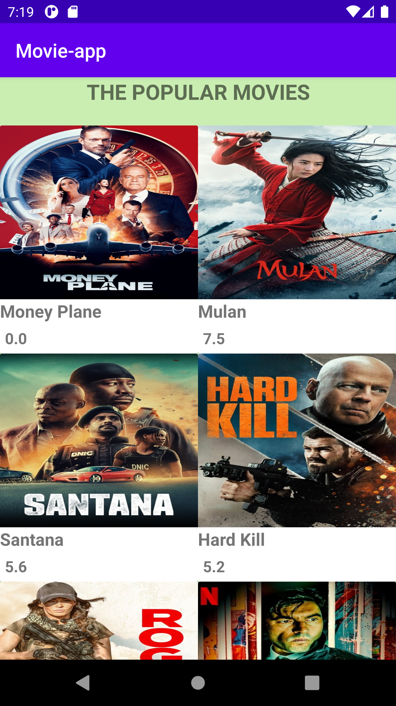
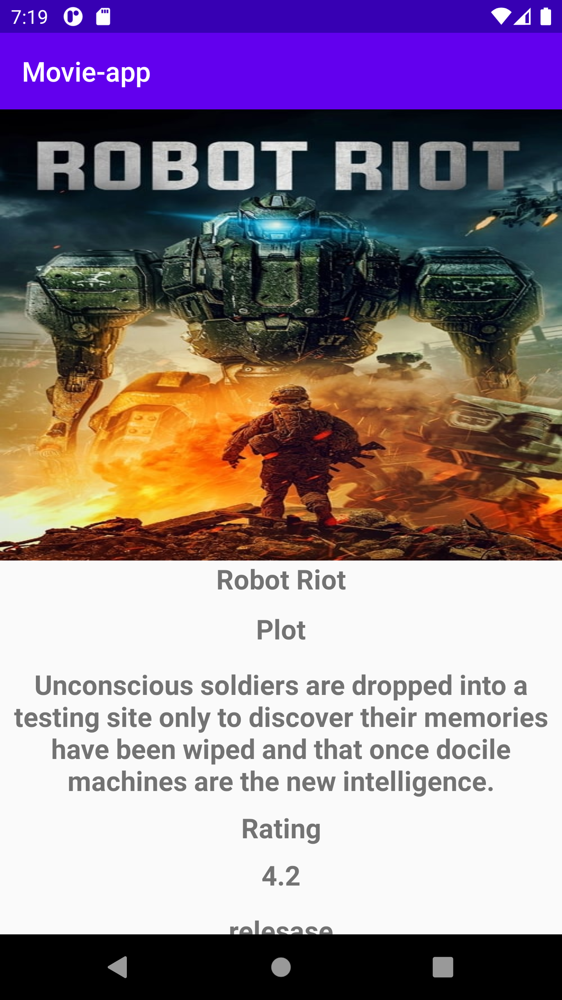

# Movie-app
A Movie detail app
Fetching Movie details from the movie databaseapi
The apk of this app is inside newly self merged file.
The library used Retrofit, Glide . The API Used from" https://developers.themoviedb.org/3/movies/get-movie-details"

     
     

   

